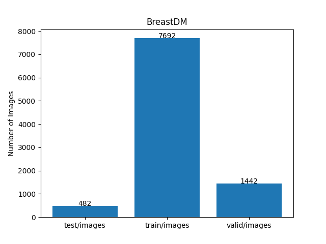

<h2>TensorFlow-FlexUNet-Image-Segmentation-BreastDM-DCE-MRI (2025/09/05)</h2>

Toshiyuki A. Arai: Software Laboratory @antillia.com 
 
This is the first experiment of Image Segmentation for BreastDM-DCE(Dynamic Contrast-Enhanced)-MRI (Benign and Malignant)
 based on our 
TensorFlowFlexUNet (TensorFlow Flexible UNet Image Segmentation Model for Multiclass) 
and a 512x512 pixels 
<a href="https://drive.google.com/file/d/1gXjdR84yuZUXwAgVEoDu6uykYBpRD-C8/view?usp=sharing">
BreastDM-ImageMask-Dataset.zip</a> with colorized masks (benign:green, malignant:red), 
which was derived by us from the following dataset on the google drive 
<a href="https://drive.google.com/file/d/1GvNwL4iPcB2GRdK2n353bKiKV_Vnx7Qg/view">
BreaDM.zip
</a> specified in a repository <a href="https://github.com/smallboy-code/Breast-cancer-dataset">Breast-cancer-dataset</a>

  
On BreaDM dataset, please refer to <a href="https://www.sciencedirect.com/science/article/abs/pii/S0010482523007205">
<b>BreastDM: A DCE-MRI dataset for breast tumor image segmentation and classification</b></a>
, and <a href="https://github.com/smallboy-code/Breast-cancer-dataset">Breast-cancer-dataset</a> .
 

Please see also our experiment for a singleclass segmentation model 
<a href="https://github.com/sarah-antillia/Tensorflow-Image-Segmentation-Malignant-BreastDM">
Tensorflow-Image-Segmentation-Malignant-BreastDM
</a>
 
 
<b>Acutual Image Segmentation for 512x512 BreastDM images</b> 

As shown below, the inferred masks predicted by our segmentation model trained on the 
PNG dataset appear similar to the ground truth masks. 
<b>rgb_map =  (benign:green, malignant:red)</b> 
 
 
<table>
<tr>
<th>Input: image</th>
<th>Mask (ground_truth)</th>
<th>Prediction: inferred_mask</th>
</tr>
<tr>
<td></td>
<td></td>
<td></td>
</tr>
<tr>
<td></td>
<td></td>
<td></td>
</tr>
<tr>
<td></td>
<td></td>
<td></td>
</tr>
</table>

 
<h3>1. Dataset Citation</h3>
The dataset used here has been obtained from the google drive

</a> <a href="https://drive.google.com/file/d/1GvNwL4iPcB2GRdK2n353bKiKV_Vnx7Qg/view">
BreaDM.zip
</a> specified in <a href="https://github.com/smallboy-code/Breast-cancer-dataset">Breast-cancer-dataset</a>

  
On BreastDM dataset, please refer to
<a href="https://www.sciencedirect.com/science/article/abs/pii/S0010482523007205">
 BreastDM: A DCE-MRI dataset for breast tumor image segmentation and classification</b>
</a> 
Xiaoming Zhao, Yuehui Liao, Jiahao Xie, Xiaxia He, Shiqing Zhang, Guoyu Wang  , Jiangxiong Fang
, Hongsheng Lu, Jun Yu  

<a href="https://doi.org/10.1016/j.compbiomed.2023.107255">https://doi.org/10.1016/j.compbiomed.2023.107255</a> 

 
<h3>
<a id="2">
2 BreastDM ImageMask Dataset
</a>
</h3>
 If you would like to train this BreastDM Segmentation model by yourself,
 please download the dataset from the google drive 
<a href="https://drive.google.com/file/d/1gXjdR84yuZUXwAgVEoDu6uykYBpRD-C8/view?usp=sharing">
BreastDM-ImageMask-Dataset.zip</a>.
 
, expand the downloaded ImageMaskDataset and put it under <b>./dataset</b> folder to be
<pre>
./dataset
└─BreastDM
    ├─test
    │   ├─images
    │   └─masks
    ├─train
    │   ├─images
    │   └─masks
    └─valid
        ├─images
        └─masks
</pre>
 
On the derivation of this dataset, please refer to
<a href="https://github.com/sarah-antillia/Tensorflow-Image-Segmentation-Malignant-BreastDM/blob/main/projects/TensorflowSlightlyFlexibleUNet/Malignant-BreastDM/generator/TrainMalignantImageMaskDatasetGenerator.py">
TrainMalignantImageMaskDatasetGenerator.py
</a> in our repository 
<a href="https://github.com/sarah-antillia/Tensorflow-Image-Segmentation-Malignant-BreastDM">
Tensorflow-Image-Segmentation-Malignant-BreastDM
</a>
 
 
<b>BreastDM Statistics</b> 
 
 

 

As shown above, the number of images of train and valid datasets is large enough to use for a training set of our segmentation model.
 
 
<b>Train_images_sample</b> 

 
<b>Train_masks_sample</b> 

 
<h3>
3 Train TensorFlowFlexUNet Model
</h3>
 We trained BreastDM TensorFlowFlexUNet Model by using the following
<a href="./projects/TensorFlowFlexUNet/BreastDM/train_eval_infer.config"> <b>train_eval_infer.config</b></a> file.  
Please move to ./projects/TensorFlowFlexUNet/BreastDM and run the following bat file. 
<pre>
>1.train.bat
</pre>
, which simply runs the following command. 
<pre>
>python ../../../src/TensorFlowFlexUNetTrainer.py ./train_eval_infer.config
</pre>

<b>Model parameters</b> 
Defined a small <b>base_filters = 16 </b> and large <b>base_kernels = (7,7)</b> for the first Conv Layer of Encoder Block of 
<a href="./src/TensorFlowFlexUNet.py">TensorFlowFlexUNet.py</a> 
and a large num_layers (including a bridge between Encoder and Decoder Blocks).
<pre>
[model]
;You may specify your own UNet class derived from our TensorFlowFlexModel
model         = "TensorFlowFlexUNet"
generator     =  False
image_width    = 512
image_height   = 512
image_channels = 3
num_classes    = 3

base_filters   = 16
base_kernels   = (7,7)
num_layers     = 8
dropout_rate   = 0.05
dilation       = (1,1)
</pre>
<b>Learning rate</b> 
Defined a very small learning rate.  
<pre>
[model]
learning_rate  = 0.00007
</pre>
<b>Loss and metrics functions</b> 
Specified "categorical_crossentropy" and <a href="./src/dice_coef_multiclass.py">"dice_coef_multiclass"</a>. 
<pre>
[model]
loss           = "categorical_crossentropy"
metrics        = ["dice_coef_multiclass"]
</pre>
<b>Dataset class</b> 
Specifed <a href="./src/ImageCategorizedMaskDataset.py">ImageCategorizedMaskDataset</a> class. 
<pre>
[dataset]
class_name    = "ImageCategorizedMaskDataset"
</pre>
 
<b>Learning rate reducer callback</b> 
Enabled learing_rate_reducer callback, and a small reducer_patience.
<pre> 
[train]
learning_rate_reducer = True
reducer_factor     = 0.5
reducer_patience   = 4
</pre>
<b>Early stopping callback</b> 
Enabled early stopping callback with patience parameter.
<pre>
[train]
patience      = 10
</pre>

<b>RGB Color map</b> 
rgb color map dict for BreastDM 1+2 classes. 
<pre>
[mask]
mask_file_format = ".png"

; RGB colors    benign:green, malignanat:red    
rgb_map = {(0,0,0):0,(0,255,0):1,(255,0,0):2,}
</pre>

<b>Epoch change inference callback</b> 
Enabled <a href="./src/EpochChangeInferencer.py">epoch_change_infer callback (EpochChangeInferencer.py)</a></b>. 
<pre>
[train]
epoch_change_infer       = True
epoch_change_infer_dir   = "./epoch_change_infer"
num_infer_images         = 6
</pre>

By using this callback, on every epoch_change, the inference procedure can be called
 for 6 images in <b>mini_test</b> folder. This will help you confirm how the predicted mask changes 
 at each epoch during your training process.    

<b>Epoch_change_inference output at starting (epoch 1,2,3)</b> 
 
 
<b>Epoch_change_inference output at middlepoint (epoch 11,12,13)</b> 
 
 
<b>Epoch_change_inference output at ending (epoch 23,24,25)</b> 
 
 
In this experiment, the training process was terminated at epoch 25.  
 
 

<a href="./projects/TensorFlowFlexUNet/BreastDM/eval/train_metrics.csv">train_metrics.csv</a> 
 

 
<a href="./projects/TensorFlowFlexUNet/BreastDM/eval/train_losses.csv">train_losses.csv</a> 
 

 

<h3>
4 Evaluation
</h3>
Please move to <b>./projects/TensorFlowFlexUNet/BreastDM</b> folder, 
and run the following bat file to evaluate TensorFlowFlexUNet model for BreastDM. 
<pre>
./2.evaluate.bat
</pre>
This bat file simply runs the following command.
<pre>
python ../../../src/TensorFlowFlexUNetEvaluator.py ./train_eval_infer_aug.config
</pre>

Evaluation console output: 

  

<a href="./projects/TensorFlowFlexUNet/BreastDM/evaluation.csv">evaluation.csv</a> 
The loss (categorical_crossentropy) to this BreastDM/test was very low and dice_coef_multiclass 
very high as shown below.
 
<pre>
categorical_crossentropy,0.0004
dice_coef_multiclass,0.9997
</pre>
 

<h3>
5 Inference
</h3>
Please move <b>./projects/TensorFlowFlexUNet/BreastDM</b> folder 
,and run the following bat file to infer segmentation regions for images by the Trained-TensorFlowFlexUNet model for BreastDM. 
<pre>
./3.infer.bat
</pre>
This simply runs the following command.
<pre>
python ../../../src/TensorFlowFlexUNetInferencer.py ./train_eval_infer_aug.config
</pre>

<b>mini_test_images</b> 
 
<b>mini_test_mask(ground_truth)</b> 
 

<b>Inferred test masks</b> 
 
 

<b>Enlarged images and masks of 512x512 pixels</b> 
<b>rgb_map =  (benign:green, malignant:red)</b> 
<table>
<tr>
<th>Image</th>
<th>Mask (ground_truth)</th>
<th>Inferred-mask</th>
</tr>

<tr>
<td></td>
<td></td>
<td></td>
</tr>

<tr>
<td></td>
<td></td>
<td></td>
</tr>

<tr>
<td></td>
<td></td>
<td></td>
</tr>

<tr>
<td></td>
<td></td>
<td></td>
</tr>

<tr>
<td></td>
<td></td>
<td></td>
</tr>

<tr>
<td></td>
<td></td>
<td></td>
</tr>
</table>

 
<h3>
References
</h3>
<b>1. BreastDM: A DCE-MRI dataset for breast tumor image segmentation and classification</b> 
Xiaoming Zhao, Yuehui Liao, Jiahao Xie, Xiaxia He, Shiqing Zhang, Guoyu Wang  , Jiangxiong Fang
, Hongsheng Lu, Jun Yu  
<a href="https://doi.org/10.1016/j.compbiomed.2023.107255">https://doi.org/10.1016/j.compbiomed.2023.107255</a> 
<a href="https://www.sciencedirect.com/science/article/abs/pii/S0010482523007205">
https://www.sciencedirect.com/science/article/abs/pii/S0010482523007205</a>
 
 
<b>2. Tensorflow-Image-Segmentation-Malignant-BreastDM</b> 
Toshiyuki Arai @antillia.com 
<a href="https://github.com/sarah-antillia/Tensorflow-Image-Segmentation-Malignant-BreastDM">
https://github.com/sarah-antillia/Tensorflow-Image-Segmentation-Malignant-BreastDM
</a>
 
 
